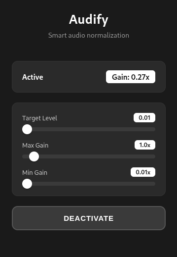

# Audify

Browser extension that applies real-time audio normalization to video elements across any website.

## Technical Overview

Web videos often have inconsistent audio levels between content, causing constant manual volume adjustments. This extension solves that by intercepting the audio stream through the Web Audio API and applying dynamic compression and gain adjustment in real-time.

The normalization algorithm analyzes the RMS (Root Mean Square) volume every 100ms and adjusts the gain to maintain a consistent target level. This prevents both uncomfortably loud peaks and barely audible quiet sections without requiring pre-processing or buffering.

### System Components

The extension runs two processes: a content script injected into web pages that handles video detection and audio processing, and a popup interface for user controls. Communication between them uses Chrome's message passing API.

**Video Discovery**
Video elements are detected using MutationObserver to monitor DOM changes. The system watches for both new video elements being added and src attribute changes on existing elements. Each discovered video is tracked in a WeakSet to prevent reprocessing. The discovery process also traverses same-origin iframes to handle embedded players.

**Audio Processing**
Once a video is detected, a MediaElementAudioSourceNode is created from the HTMLVideoElement. This node feeds into a processing chain of GainNode, DynamicsCompressorNode, and a second DynamicsCompressorNode configured as a limiter. The output connects to the AudioContext destination.

The system maintains two modes: active processing with the full chain, and bypass mode where the source connects directly to the destination. Switching between modes disconnects and reconnects the graph without recreating the AudioContext.

**State Management**
A normalization loop runs every 100ms when active, measuring current RMS volume through an AnalyserNode and calculating the required gain adjustment. Configuration and state are persisted to chrome.storage.local and synchronized between the popup and content script.

**Site-Specific Integrations**
Netflix integration includes automatic skip intro functionality that detects and clicks the skip button when available. YouTube integration is planned with a TODO for similar auto-skip capabilities.

### Video Detection Strategy

The extension uses a multi-layered approach to detect video elements:

1. **MutationObserver** monitors the DOM for new video elements and src attribute changes
2. **Debounced discovery** prevents excessive reprocessing during rapid DOM mutations
3. **WeakSet tracking** ensures each video element is processed once
4. **Iframe traversal** handles embedded players while respecting same-origin policy
5. **Retry mechanism** with exponential backoff for single-page applications that load videos asynchronously

This strategy handles YouTube Shorts navigation, Netflix episode changes, and dynamic video injection without requiring page reloads.

### Audio Graph Architecture

Audio processing follows this signal chain:

```
HTMLVideoElement → MediaElementSource → GainNode → Compressor → Limiter → AudioContext.destination
```

The graph builder implements two strategies:

**Active Mode**: Full processing chain with normalization
**Bypass Mode**: Direct connection to destination, preserving original audio

Re-initialization is handled carefully to prevent MediaElementAudioSourceNode conflicts, which occur when multiple AudioContexts attempt to attach to the same video element. The system tracks the current video element and only reinitializes when the source actually changes, not when the DOM reference changes.

### Normalization Algorithm

The audio processor samples volume every 100ms and calculates required gain:

```
targetGain = targetLevel / currentRMS
clampedGain = clamp(targetGain, minGain, maxGain)
```

Gain changes are smoothed using exponentialRampToValueAtTime to prevent audible clicks. The smoothing time constant varies based on whether the adjustment is increasing or decreasing volume, with faster response for volume increases to prevent clipping.

When the user seeks within the video, gain is reset to a mid-point to handle potential volume changes in the new section.

## Installation

### Development Setup

```bash
npm install
npm run build
```

### Loading the Extension

Chrome:
1. Navigate to chrome://extensions/
2. Enable Developer mode
3. Click "Load unpacked"
4. Select the project directory

Edge:
1. Navigate to edge://extensions/
2. Enable Developer mode
3. Click "Load unpacked"
4. Select the project directory

## Usage

The extension activates automatically when video elements are detected. Click the extension icon to access controls:



**Toggle**: Enable or disable normalization
**Target Level**: Desired RMS volume (0.02 to 0.3)
**Max Gain**: Maximum amplification limit (1.0 to 8.0)
**Min Gain**: Minimum attenuation limit (0.1 to 1.0)

Configuration is stored in chrome.storage.local and persists across sessions.

## Technical Stack

- TypeScript with strict type checking
- React 18 for popup UI
- Web Audio API for signal processing
- Chrome Extension Manifest V3
- Vite for building

## Permissions

**storage**: Configuration persistence
**tabs**: Site information detection
**host_permissions**: `<all_urls>` for video detection across all sites

## Debugging

Open the browser console (F12) on any page with video content. The extension prefixes all logs with `[Audify]`:

- Video discovery events
- Audio graph initialization
- Normalization state changes
- Health check status
- Error conditions

Debug logs are only visible when `shouldLog` returns true in ConsoleLogger. Error and warning levels are always visible.
